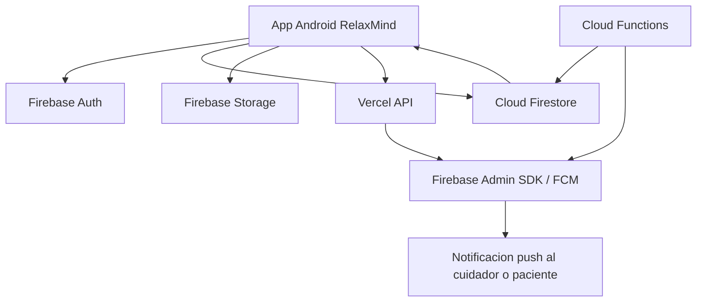
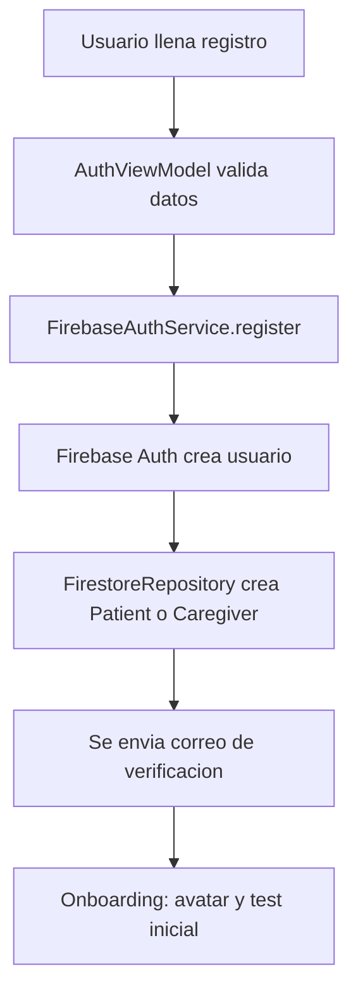
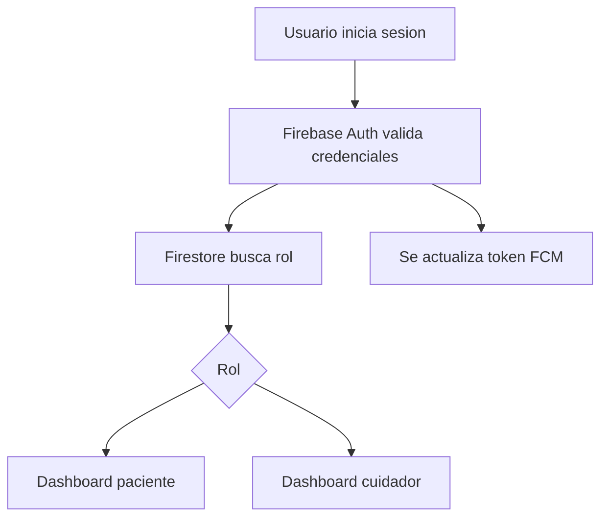
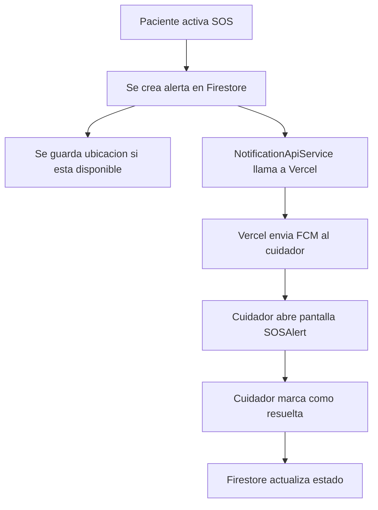
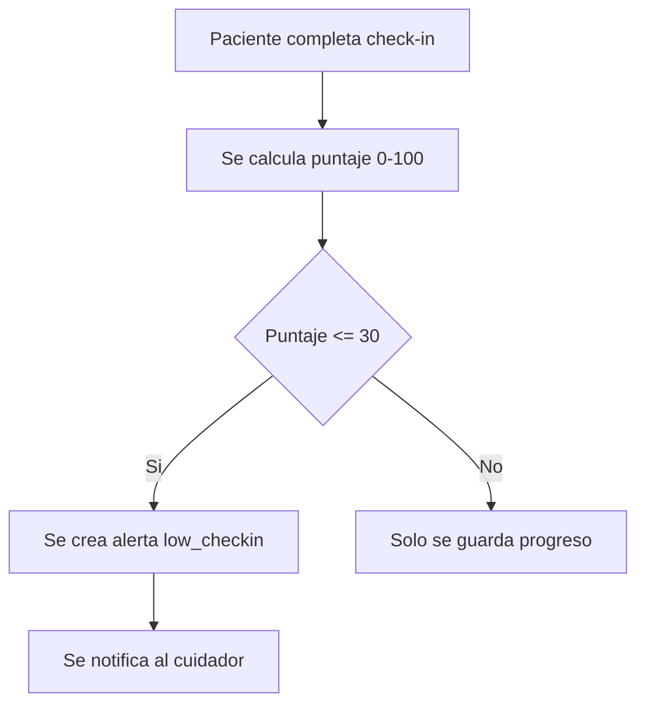
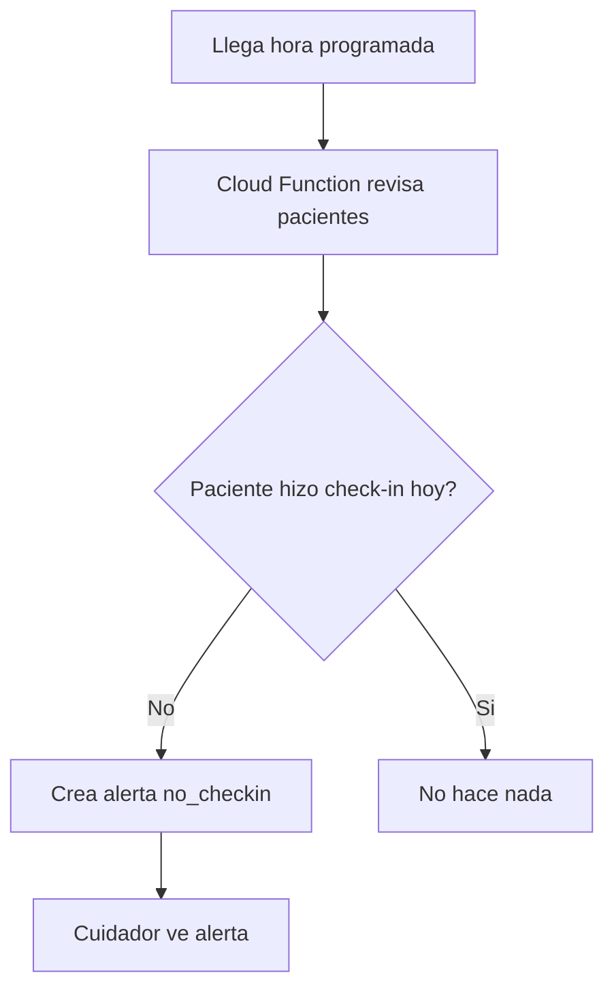
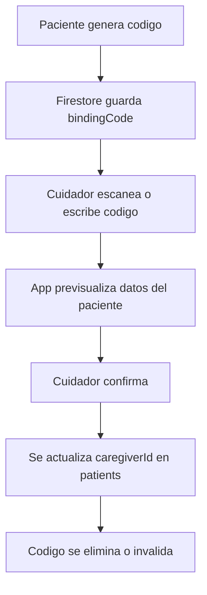
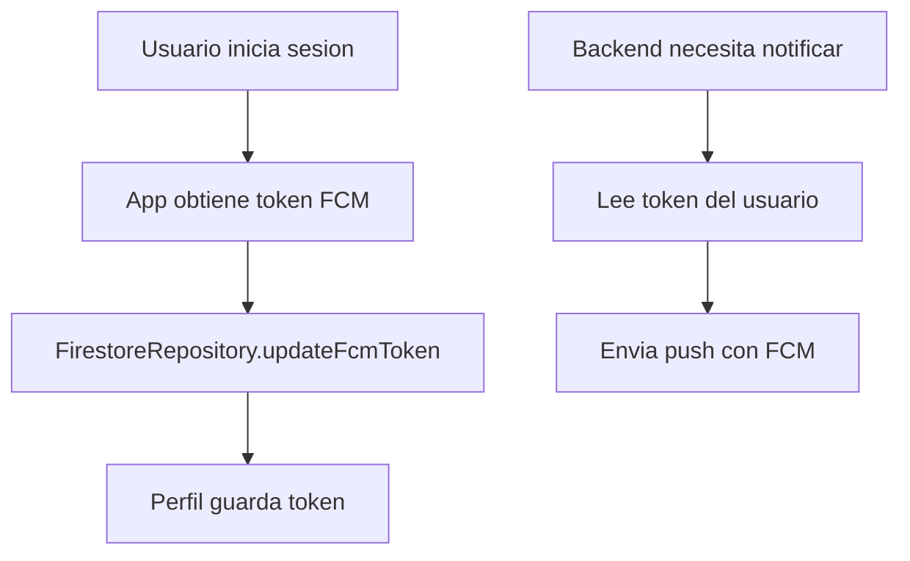

# Guion de exposicion: Firebase y Vercel en RelaxMind

## 1. Idea principal para abrir tu parte

En RelaxMind, Firebase y Vercel son la base de la comunicacion entre la app, los usuarios y las notificaciones importantes.

Mi parte se encarga de explicar como guardamos los datos, como autenticamos usuarios, como vinculamos pacientes con cuidadores, como enviamos alertas SOS, como funcionan los recordatorios y por que elegimos una arquitectura en tiempo real.

Una forma clara de decirlo:

> En RelaxMind usamos Firebase como backend principal porque nos permite manejar autenticacion, base de datos en tiempo real, almacenamiento y notificaciones push sin tener que construir un servidor tradicional desde cero. Ademas usamos Vercel como capa serverless para exponer endpoints seguros de notificaciones, evitando que la app Android tenga credenciales sensibles.

## 2. Por que elegimos Firebase

Firebase fue elegido porque RelaxMind necesita varias cosas al mismo tiempo:

- Inicio de sesion seguro.
- Registro de pacientes y cuidadores.
- Datos sincronizados en tiempo real.
- Notificaciones push para alertas importantes.
- Escalabilidad sin administrar servidores.
- Integracion directa con Android/Kotlin.

Firebase nos dio estas piezas:

- **Firebase Authentication**: gestiona login, registro, recuperacion de contrasena, verificacion por correo y Google Sign-In.
- **Cloud Firestore**: guarda pacientes, cuidadores, check-ins, agenda, alertas, diario, sesiones de Lumi y codigos de vinculacion.
- **Firebase Cloud Messaging**: envia notificaciones push al celular.
- **Firebase Storage**: preparado para imagenes como avatares o fotos del diario.
- **Cloud Functions**: ejecuta tareas automaticas, como revisar si un paciente no hizo check-in.

Frase para exposicion:

> Firebase nos ayuda porque nuestra app no es solo una pantalla bonita. Necesita datos vivos. Si un paciente manda un SOS, el cuidador debe verlo casi al instante. Para eso Firestore y FCM son claves.

## 3. Por que usamos Vercel

Vercel se usa como capa serverless para endpoints HTTP.

En la app Android no debemos guardar claves privadas de Firebase Admin SDK ni secretos del servidor. Por eso, cuando la app necesita disparar una notificacion importante, envia una peticion a un endpoint seguro desplegado en Vercel.

Ventajas:

- No exponemos credenciales sensibles en Android.
- Desplegamos endpoints rapido.
- Es facil mantener rutas como `/api/send-sos-alert`.
- Separamos la app movil de la logica sensible del servidor.
- Podemos modificar la logica de notificaciones sin actualizar toda la app.

Frase para exposicion:

> Vercel funciona como un puente seguro. La app no manda directamente una notificacion usando claves privadas; solo pide al backend que lo haga. Asi protegemos los secretos del proyecto.

## 4. Arquitectura general



Explicacion:

- La app se autentica con Firebase Auth.
- La informacion se guarda en Firestore.
- Firestore se escucha en tiempo real con `addSnapshotListener`.
- Vercel recibe peticiones para enviar alertas push.
- Cloud Functions ejecuta procesos automaticos, como check-ins pendientes.

## 5. Archivos principales relacionados

### `app/build.gradle.kts`

Este archivo configura las dependencias y servicios principales del proyecto Android.

Puntos importantes:

- Aplica el plugin `com.google.gms.google-services`.
- Usa Firebase BOM para mantener versiones compatibles.
- Agrega dependencias de:
  - Firebase Auth.
  - Firestore.
  - Storage.
  - Messaging.
- Define variables como:
  - `NOTIFICATIONS_BASE_URL`.
  - `MAPS_API_KEY`.
  - `GROQ_API_KEY`.
  - `GOOGLE_WEB_CLIENT_ID`.

Que puedes decir:

> En `build.gradle.kts` conectamos la app con Firebase. El BOM de Firebase nos evita conflictos de versiones, porque mantiene todas las librerias Firebase alineadas.

### `settings.gradle.kts`

Define la estructura del proyecto Gradle.

Incluye:

- Repositorios como `google()` y `mavenCentral()`.
- Nombre del proyecto.
- Modulo principal `:app`.

Que puedes decir:

> Este archivo no contiene logica de Firebase, pero permite que Gradle encuentre las dependencias necesarias desde los repositorios oficiales.

### `app/google-services.json`

Este archivo conecta la app Android con el proyecto Firebase correcto.

Contiene datos como:

- `project_id`.
- `mobilesdk_app_id`.
- `api_key`.
- `package_name`.

Importante:

- Debe estar en `app/google-services.json`.
- No debe editarse manualmente.
- Se descarga desde Firebase Console.

Que puedes decir:

> `google-services.json` es como la credencial publica de configuracion del proyecto Firebase para Android. No es una clave de servidor, pero si debe corresponder al paquete correcto de la app.

## 6. Autenticacion

### `FirebaseAuthService.kt`

Este archivo encapsula Firebase Authentication.

Funciones principales:

- `register(email, password)`: crea una cuenta nueva.
- `login(email, password)`: inicia sesion.
- `loginWithGoogleCredential(...)`: permite login con Google.
- `logout()`: cierra sesion.
- `sendVerificationEmail()`: envia correo de verificacion.
- `resetPassword(email)`: envia correo para restablecer contrasena.
- `getCurrentUser()`: obtiene el usuario actual.
- `isLoggedIn()`: valida si hay sesion activa.

Por que existe:

No llamamos Firebase Auth directamente desde cada pantalla. Creamos un servicio para centralizar la logica.

Que puedes decir:

> `FirebaseAuthService` es una capa de abstraccion. Si manana cambiamos algun detalle de autenticacion, no tenemos que tocar todas las pantallas, solo este servicio.

### `AuthViewModel.kt`

Este ViewModel conecta la UI de login/registro con Firebase.

Responsabilidades:

- Validar formularios.
- Registrar pacientes y cuidadores.
- Crear el documento del usuario en Firestore.
- Enviar correo de verificacion.
- Obtener el rol del usuario.
- Guardar token FCM.
- Reactivar cuentas eliminadas dentro del plazo permitido.

Flujo de registro:

1. El usuario llena sus datos.
2. Se validan campos.
3. Se crea cuenta en Firebase Auth.
4. Se crea documento en `patients` o `caregivers`.
5. Se envia correo de verificacion.
6. Se continua el onboarding.

Que puedes decir:

> Firebase Auth solo sabe que existe un usuario, pero no sabe si es paciente o cuidador. Por eso, despues del registro, guardamos un documento en Firestore con el rol y los datos del perfil.

## 7. Base de datos: Firestore

### `FirestoreRepository.kt`

Este es uno de los archivos mas importantes del backend en la app.

Funciona como repositorio central para leer y escribir datos en Firestore.

Ventajas:

- Evita repetir codigo de Firebase en muchas pantallas.
- Centraliza nombres de colecciones.
- Facilita usar `Result<T>` y manejar errores.
- Permite listeners en tiempo real.

Principales areas que maneja:

#### Usuarios

- `createPatient(patient)`
- `createCaregiver(caregiver)`
- `getPatientById(id)`
- `getCaregiverById(id)`
- `getLinkedCaregiverProfile(patientId)`
- `updatePatient(id, fields)`
- `updateCaregiver(id, fields)`
- `getRoleById(id)`
- `updateFcmToken(userId, role, token)`

Explicacion:

Los datos del usuario no se guardan solo en Auth. Auth guarda identidad; Firestore guarda perfil, rol, preferencias y datos de salud.

#### Vinculacion paciente-cuidador

- `createBindingCode(...)`
- `listenToBindingCode(...)`
- `previewPatientForBindingCode(...)`
- `linkPatientWithCode(...)`
- `listenPatientsForCaregiver(...)`
- `deleteBindingCode(...)`

Flujo:

1. El paciente genera un codigo temporal.
2. Se guarda en `bindingCodes`.
3. El cuidador escanea o ingresa el codigo.
4. La app muestra datos basicos del paciente para confirmar.
5. Si confirma, se actualiza `patients/{patientId}.caregiverId`.
6. Se elimina o invalida el codigo.

Que puedes decir:

> La vinculacion no se hace escribiendo manualmente el ID del cuidador. Usamos codigos temporales para que el proceso sea mas seguro y controlado.

#### Alertas

- `createAlert(alert)`
- `listenAlertsForCaregiver(caregiverId)`
- `listenAlertsForPatient(patientId)`
- `listenToAlert(alertId)`
- `updateAlertResolved(alertId, resolved)`
- `updateAlertFields(alertId, fields)`
- `getActiveCaregiverAlerts(caregiverId)`

Tipos de alertas:

- SOS.
- Check-in bajo.
- Sin check-in.
- Cancelada.
- Resuelta.

Que puedes decir:

> Las alertas no son simples notificaciones. Tambien quedan registradas en Firestore para que el cuidador pueda ver historial, estado y seguimiento.

#### Check-in y progreso

- `createCheckIn(checkIn)`
- `getTodayCheckIn(patientId)`
- `getLatestCheckIn(patientId)`
- `getPatientCheckIns(patientId)`
- `getPatientStreak(patientId)`
- `updatePatientStreak(...)`

Explicacion:

Cada check-in guarda puntaje, fecha, categoria y datos relacionados al bienestar del paciente.

Regla importante:

- Si el puntaje es menor o igual a 30, se considera bajo y puede generar alerta al cuidador.

#### Agenda

- `createAppointment(appointment)`
- `getAppointments(patientId)`
- `getAppointment(appointmentId)`
- `updateAppointmentCompletion(...)`
- `deleteAppointment(...)`
- `getAppointmentsForMonth(...)`

Explicacion:

La agenda guarda citas, medicamentos y recordatorios. Puede integrarse con notificaciones locales o push segun el caso.

#### Diario

- `createDiaryEntry(entry)`
- `getDiaryEntries(patientId)`
- `getDiaryEntriesForMonth(...)`
- `getDiaryEntriesCount(patientId)`

Explicacion:

El diario permite guardar emociones, notas y fotos. Es informacion privada del paciente y debe protegerse con reglas.

#### Lumi

- `getActiveLumiSession(patientId)`
- `createLumiSession(...)`
- `listenToLumiMessages(sessionId)`
- `addLumiMessage(...)`
- `getLumiSessionsHistory(patientId)`
- `archiveLumiSession(...)`

Explicacion:

Lumi guarda conversaciones por sesiones para que el usuario pueda revisar su historial.

## 8. Modelos de datos

Los modelos estan en `data/model/`.

### `Patient.kt`

Representa al usuario paciente.

Campos importantes:

- `id`
- `role = "patient"`
- `name`
- `lastName`
- `email`
- `phone`
- `birthDate`
- `condition`
- `avatarUrl`
- `fcmToken`
- `caregiverId`
- `linkedCaregiverAt`
- `notificationsEnabled`
- `checkInReminderEnabled`
- `onboardingCompleted`
- `isDeleted`
- `deletedAt`

Explicacion:

Este modelo guarda tanto informacion personal como configuraciones de la app.

### `Caregiver.kt`

Representa al cuidador.

Campos importantes:

- `id`
- `role = "caregiver"`
- `name`
- `lastName`
- `email`
- `phone`
- `avatarUrl`
- `fcmToken`
- `notificationsEnabled`
- `onboardingCompleted`
- `isDeleted`

Explicacion:

El cuidador puede vincular hasta 5 pacientes y recibir alertas de ellos.

### Otros modelos importantes

- `CheckIn`: guarda respuestas y puntaje del check-in.
- `CaregiverAlert`: representa alertas visibles para el cuidador.
- `BindingCode`: codigo temporal de vinculacion.
- `Appointment`: evento o recordatorio de agenda.
- `DiaryEntry`: nota del diario.
- `LumiMessage` y `LumiSession`: mensajes y sesiones del chat.
- `Streak`: racha del paciente.
- `UserAchievement`: logros desbloqueados.

## 9. Notificaciones push

### `RelaxMindMessagingService.kt`

Este servicio recibe mensajes de Firebase Cloud Messaging.

Responsabilidades:

- Recibir notificaciones cuando la app esta en primer plano.
- Procesar datos del mensaje.
- Mostrar notificaciones locales.
- Manejar nuevos tokens FCM con `onNewToken`.

Que puedes decir:

> FCM no solo muestra una notificacion; tambien nos permite mandar datos para abrir una pantalla especifica, por ejemplo una alerta SOS.

### `NotificationUtils.kt`

Este archivo crea los canales de notificacion de Android.

Por que es necesario:

Desde Android 8, las notificaciones deben pertenecer a un canal.

Canales esperados:

- SOS.
- Bienestar bajo.
- Recordatorios.
- Citas.
- Check-in.
- Racha.

Que puedes decir:

> Android exige canales para organizar notificaciones. Asi podemos diferenciar una alerta SOS de un recordatorio comun.

### `NotificationApiService.kt`

Este archivo envia peticiones HTTP desde Android hacia Vercel.

Funciones principales:

- `sendSosAlert(...)`
- `sendWellnessAlert(...)`

Endpoint usados:

- `/api/send-sos-alert`
- `/api/send-wellness-alert`

Que envia:

- `patientId`
- `caregiverId`
- `alertId`
- `patientName`
- `score`
- `category`

Por que no se manda FCM directo desde Android:

Porque para enviar notificaciones a otros usuarios de forma segura se necesita logica de servidor. No debemos poner claves privadas en el APK.

Frase para exposicion:

> Android avisa al backend de Vercel que ocurrio algo importante. Vercel valida y manda la notificacion por FCM al dispositivo correcto.

## 10. Cloud Functions

### `functions/index.js`

Este archivo contiene funciones backend que se ejecutan en Firebase.

#### `sendSOSAlert`

Se activa cuando se crea un documento nuevo en:

```text
alerts/{alertId}
```

Funcionamiento:

1. Detecta una nueva alerta.
2. Verifica el tipo de alerta.
3. Busca al cuidador.
4. Obtiene su `fcmToken`.
5. Busca datos del paciente.
6. Envia notificacion push.

Que puedes decir:

> Esta funcion es reactiva. No necesita que el usuario presione nada extra: si aparece una alerta en Firestore, el backend responde automaticamente.

#### `checkDailyCheckIns`

Se ejecuta todos los dias cerca de medianoche, zona horaria `America/Lima`.

Funcionamiento:

1. Recorre pacientes vinculados.
2. Revisa si hicieron check-in hoy.
3. Si no hicieron check-in, crea una alerta `no_checkin`.
4. Evita duplicar alertas del mismo dia.

Que puedes decir:

> Esta funcion nos permite detectar ausencia de check-in incluso si el paciente no abre la app.

#### `sendCheckInReminder`

Se ejecuta por la noche.

Funcionamiento:

1. Busca pacientes con recordatorio activo.
2. Verifica si ya hicieron check-in.
3. Si no lo hicieron, envia un recordatorio.

Que puedes decir:

> Esto ayuda a mantener la racha y fomenta habitos saludables sin depender de que el usuario recuerde abrir la app.

## 11. Flujos principales explicados

### Flujo de registro



Explicacion para decir:

> El registro tiene dos capas: primero Firebase Auth crea la identidad segura, luego Firestore guarda el perfil completo con rol y preferencias.

### Flujo de login



Explicacion:

El rol no viene de Auth directamente. Se consulta en Firestore para saber que dashboard abrir.

### Flujo de SOS



Puntos importantes:

- La alerta queda guardada.
- Si el paciente cancela, debe cambiar estado a cancelada.
- Si el cuidador resuelve, cambia a resuelta.
- El historial conserva la informacion.

### Flujo de check-in bajo



Explicacion:

El check-in no solo actualiza el progreso. Tambien puede generar una alerta si el bienestar esta en nivel bajo.

### Flujo de no check-in



Explicacion:

Esto permite que el cuidador sepa si un paciente dejo de reportar su estado.

### Flujo de vinculacion



Explicacion:

La vinculacion se basa en un codigo temporal. Esto evita enlazar usuarios por error y permite mostrar una confirmacion antes de completar el proceso.

## 12. Colecciones principales en Firestore

### `patients`

Guarda perfiles de pacientes.

Ejemplo de datos:

- nombre
- correo
- telefono
- cuidador vinculado
- avatar
- preferencias
- token FCM

### `caregivers`

Guarda perfiles de cuidadores.

Ejemplo:

- nombre
- correo
- telefono
- token FCM
- preferencias

### `bindingCodes`

Guarda codigos temporales de vinculacion.

Campos esperados:

- codigo
- patientId
- expiresAt
- caregiverId opcional
- estado

### `alerts`

Guarda alertas.

Campos esperados:

- type
- patientId
- caregiverId
- resolved
- status
- createdAt
- score opcional
- location opcional

### `checkIns`

Guarda check-ins diarios.

Campos:

- patientId
- score
- category
- createdAt
- respuestas

### `appointments`

Guarda eventos de agenda.

Campos:

- patientId
- title
- date
- time
- type
- completed
- reminderMinutes

### `diaryEntries`

Guarda notas del diario.

Campos:

- patientId
- mood
- category
- text
- photos
- createdAt

### `streaks`

Guarda rachas del paciente.

Campos:

- currentStreak
- bestStreak
- lastCheckInDate
- lastNoCheckinAlertDate

### `lumiSessions` y `lumiMessages`

Guardan historial del chat con Lumi.

## 13. Seguridad y reglas de Firestore

Las reglas son importantes porque la app maneja datos sensibles de salud emocional.

Principios:

- Un paciente solo debe editar su propio perfil.
- Un cuidador solo debe ver pacientes vinculados a el.
- Un paciente puede crear su SOS.
- Un cuidador puede marcar alertas como resueltas.
- Los codigos de vinculacion deben ser temporales.
- Nadie debe leer datos de otro usuario sin relacion.

Ejemplo de explicacion:

> Las reglas de Firestore son nuestra primera barrera de seguridad. Aunque alguien modifique la app, Firestore debe impedir que lea o escriba informacion que no le corresponde.

Errores comunes:

- `PERMISSION_DENIED`: las reglas no permiten esa lectura o escritura.
- Codigo de vinculacion no funciona: reglas no permiten leer `bindingCodes`.
- Cuidador no ve pacientes antiguos: reglas no contemplan el campo `caregiverId`.
- No se puede resolver alerta: reglas no permiten actualizar `resolved`.

## 14. Tokens FCM

Cada dispositivo tiene un token FCM.

Uso:

- Se obtiene desde Firebase Messaging.
- Se guarda en Firestore dentro del perfil.
- Si el token cambia, se actualiza.
- El backend usa ese token para enviar push.

Flujo:



Que puedes decir:

> El token FCM es como la direccion del telefono para recibir notificaciones. Si cambia y no lo actualizamos, las notificaciones pueden dejar de llegar.

## 15. Relacion entre Firebase y Vercel

Firebase:

- Guarda datos.
- Autentica usuarios.
- Escucha cambios.
- Ejecuta funciones programadas.
- Envia FCM.

Vercel:

- Expone endpoints HTTP.
- Recibe solicitudes de la app.
- Ejecuta logica serverless.
- Protege claves privadas.

Frase:

> Firebase es la base de datos y sistema de usuarios. Vercel es una capa serverless que usamos para operaciones sensibles como disparar notificaciones desde un backend.

## 16. Preguntas posibles y respuestas

### Por que no usamos un backend tradicional con Node/Express?

Porque Firebase ya cubre autenticacion, base de datos en tiempo real, storage y notificaciones. Para una app movil como RelaxMind, esto reduce tiempo de desarrollo y mantenimiento.

### Por que no usamos Room?

El proyecto se definio sin cache local. Todo se sincroniza con Firestore en tiempo real. Esto ayuda a que el cuidador vea informacion actualizada.

### Firestore es seguro?

Si se configuran correctamente las reglas. La seguridad no depende solo del codigo Android; depende de las reglas de Firestore y de no exponer claves privadas.

### Que pasa si el usuario no tiene internet?

Las funciones que dependen de Firestore o FCM necesitan conexion. La app puede mostrar estados de carga o error, pero la sincronizacion real ocurre cuando hay red.

### Que pasa si cambia el token FCM?

`RelaxMindMessagingService` detecta el nuevo token y la app lo actualiza en Firestore. Asi el backend sigue enviando notificaciones al dispositivo correcto.

### Por que usar Vercel si Firebase ya tiene Cloud Functions?

Porque Vercel nos da endpoints HTTP faciles de desplegar y mantener. Firebase Functions tambien se usa para tareas automaticas. Ambas herramientas pueden convivir: Vercel para endpoints directos y Functions para eventos programados o reactivos.

### Donde se guardan las alertas?

En Firestore, en la coleccion `alerts`. La notificacion push es solo el aviso; el registro real queda en la base de datos.

### Como se sabe que un paciente pertenece a un cuidador?

En el documento del paciente existe el campo `caregiverId`. Ese campo apunta al ID del cuidador.

### Por que el cuidador puede tener varios pacientes?

Porque varios documentos de `patients` pueden tener el mismo `caregiverId`. La app limita el flujo a maximo 5 pacientes para mantener el seguimiento manejable.

### Como se reactivan cuentas eliminadas?

El sistema usa eliminacion logica con campos como `isDeleted` y `deletedAt`. Si el usuario vuelve a iniciar sesion dentro del plazo definido, la cuenta puede reactivarse.

## 17. Guion hablado completo

Puedes usar esta version casi tal cual:

> Mi parte del proyecto se enfoca en Firebase y Vercel, que son la base del backend de RelaxMind. Firebase lo usamos para manejar autenticacion, base de datos en tiempo real, almacenamiento y notificaciones push. Vercel lo usamos como una capa serverless para ejecutar endpoints seguros, especialmente cuando necesitamos enviar notificaciones sin exponer claves privadas dentro de la app Android.

> En autenticacion usamos Firebase Auth. Esto nos permite registrar usuarios con correo y contrasena, iniciar sesion, enviar correos de verificacion y recuperar contrasenas. Pero Firebase Auth solo maneja la identidad del usuario. Por eso, despues del registro, guardamos un documento en Firestore, en `patients` o `caregivers`, dependiendo del rol.

> La base de datos principal es Cloud Firestore. La elegimos porque permite sincronizacion en tiempo real. Esto es importante porque si un paciente manda una alerta SOS, el cuidador debe verla al momento. Tambien usamos Firestore para check-ins, agenda, diario, historial de alertas, codigos de vinculacion, sesiones de Lumi y preferencias.

> En el codigo tenemos un archivo muy importante llamado `FirestoreRepository.kt`. Este archivo centraliza todas las operaciones con Firestore. Por ejemplo, crear pacientes, crear cuidadores, actualizar perfiles, vincular pacientes con cuidadores, crear alertas, escuchar alertas en tiempo real, guardar check-ins y cargar eventos de agenda. Esto evita que cada pantalla tenga codigo repetido de Firebase.

> Para las notificaciones usamos Firebase Cloud Messaging. Cada usuario tiene un token FCM que se guarda en Firestore. Cuando ocurre una alerta, el backend busca el token del destinatario y envia la notificacion. Este token se actualiza desde la app para evitar que las notificaciones se pierdan si Android cambia el identificador del dispositivo.

> En el caso de una alerta SOS, el paciente activa la alerta desde la app. Se crea un documento en `alerts`, se guarda la informacion del paciente y, si hay ubicacion, tambien se actualiza. Luego la app llama a un endpoint en Vercel usando `NotificationApiService.kt`. Vercel se encarga de disparar la notificacion push al cuidador.

> Tambien usamos Cloud Functions. Por ejemplo, tenemos una funcion que revisa diariamente si un paciente no hizo check-in. Si no lo hizo, se crea una alerta de tipo `no_checkin` para el cuidador. Esto es importante porque permite detectar ausencia de actividad aunque el paciente no abra la app.

> En seguridad usamos reglas de Firestore. Estas reglas son fundamentales porque manejamos informacion sensible. Un paciente solo debe poder editar su informacion, y un cuidador solo debe leer informacion de pacientes vinculados a el. Tambien hay reglas para alertas, codigos de vinculacion y actualizaciones de estado.

> En resumen, Firebase nos da la infraestructura principal: usuarios, datos, tiempo real y notificaciones. Vercel nos da una capa segura para endpoints serverless. Juntos permiten que RelaxMind funcione como una app conectada, reactiva y segura.

## 18. Checklist antes de exponer

Antes de tu exposicion, revisa que puedas explicar:

- Que problema resuelve Firebase.
- Que problema resuelve Vercel.
- Diferencia entre Auth y Firestore.
- Por que Firestore es en tiempo real.
- Como se vincula paciente y cuidador.
- Como se envia un SOS.
- Como se genera una alerta por check-in bajo.
- Como se detecta que no hubo check-in.
- Que es un token FCM.
- Por que no se deben poner claves privadas en Android.
- Que son las reglas de Firestore.
- Que archivos del proyecto contienen esta logica.

## 19. Archivos que deberias mencionar

Lista rapida:

- `app/build.gradle.kts`
- `settings.gradle.kts`
- `app/google-services.json`
- `app/src/main/kotlin/com/relaxmind/app/MainActivity.kt`
- `app/src/main/kotlin/com/relaxmind/app/data/remote/FirebaseAuthService.kt`
- `app/src/main/kotlin/com/relaxmind/app/data/remote/FirestoreRepository.kt`
- `app/src/main/kotlin/com/relaxmind/app/data/remote/NotificationApiService.kt`
- `app/src/main/kotlin/com/relaxmind/app/data/remote/RelaxMindMessagingService.kt`
- `app/src/main/kotlin/com/relaxmind/app/utils/NotificationUtils.kt`
- `app/src/main/kotlin/com/relaxmind/app/features/auth/AuthViewModel.kt`
- `app/src/main/kotlin/com/relaxmind/app/features/patient/CheckInViewModel.kt`
- `app/src/main/kotlin/com/relaxmind/app/features/patient/SOSPatientViewModel.kt`
- `app/src/main/kotlin/com/relaxmind/app/features/caregiver/CaregiverViewModel.kt`
- `app/src/main/kotlin/com/relaxmind/app/data/model/Patient.kt`
- `app/src/main/kotlin/com/relaxmind/app/data/model/Caregiver.kt`
- `app/src/main/kotlin/com/relaxmind/app/data/model/CaregiverAlert.kt`
- `app/src/main/kotlin/com/relaxmind/app/data/model/CheckIn.kt`
- `app/src/main/kotlin/com/relaxmind/app/data/model/Appointment.kt`
- `functions/index.js`

## 20. Cierre recomendado

Puedes cerrar asi:

> La parte de Firebase y Vercel es importante porque conecta toda la experiencia de RelaxMind. Sin esta capa, la app seria solo local. Con Firebase y Vercel logramos usuarios reales, datos sincronizados, alertas al cuidador, recordatorios y seguimiento del bienestar emocional en tiempo real.

